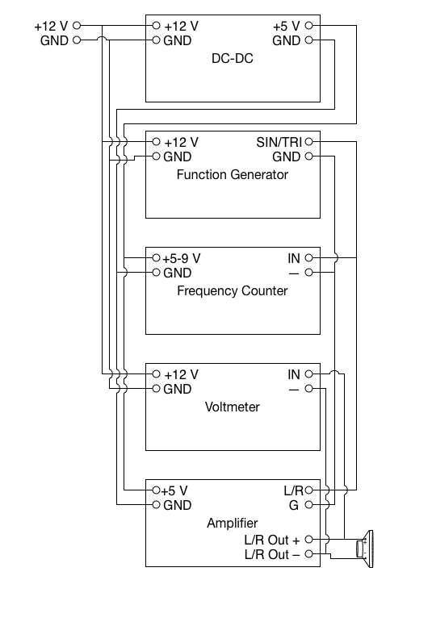

# Manual Frequency and Intensity Calibrator

## Materials
- [HiWave BMR12](https://www.amazon.com/gp/product/B0008JHBOQ/ref=od_aui_detailpages00?ie=UTF8&psc=1)
- [Drok PAM8403 Amplifier Board](https://www.amazon.com/gp/product/B00C4N410G/ref=od_aui_detailpages00?ie=UTF8&psc=1)
- [SainSmart Frequency Counter Board](https://www.amazon.com/gp/product/B00U29OHP8/ref=od_aui_detailpages00?ie=UTF8&psc=1)
- [Yeeco AC Voltmeter](https://www.amazon.com/gp/product/B00PZBEJ7Y/ref=od_aui_detailpages00?ie=UTF8&psc=1)
- [Smakn 12-to-5 V DC-DC](https://www.amazon.com/gp/product/B00CXKBJI2/ref=od_aui_detailpages00?ie=UTF8&psc=1)
- [KKMoon XR2206 Function Generator Board](https://www.amazon.com/gp/product/B01HM70CMY/ref=oh_aui_detailpage_o00_s00?ie=UTF8&psc=1)
- [12 V Power Supply](https://www.amazon.com/gp/product/B019Q3U72M/ref=od_aui_detailpages00?ie=UTF8&psc=1)
- 18-26 AWG Wire (in two or more colors)
- Solder

## Tools
- Soldering Iron
- Wire Stripper
- Wire Cutter
- Small Flat-blade Screwdriver
- Sound Level Meter
- Ruler

## Assembly Procedure
[Video of Assembly Procedure](https://www.youtube.com/watch?v=CmCu5KOqpDA)
1. Attach two wires to the BMR12 speaker
2. Attach one of the wires to both of the + outputs on the PAM8403 Board
3. Attach the other wire to both of the - outputs on the PAM8403 Board
4. Attach the yellow wire from the DC-DC to the - power terminal on the PAM8403 Board
5. Attach the output red wire from the DC-DC to the + power terminal on the PAM8403 Board
6. Assemble the frequency counter as per the [instructions](https://s3-ap-northeast-1.amazonaws.com/sain-amzn/21/21-010-340/21-010-340.zip)
7. Assemble the function generator as per the [instructions](https://www.dropbox.com/s/x9azf694mjedmv5/XR2206-DIY-Kit-Manual.pdf?dl=1)
8. Wire the ground to pin one and three of the voltmeter, the ground pin on the function generator, the ground pin on the frequency counter board, and the ground pin on the amplifier outputs
9. Wire the sine/triangle pin of the function generator to pin four of the voltmeter, the IN pin on the frequency counter, and both the L and R inputs on the Amplifier Board
10. Attach the +12 V wire from the power supply to the power pins of the voltmeter, function generator, and DC-DC
11. Attach the ground wire from the power supply to the ground pins of the voltmeter, function generator, and DC-DC

### Optional Voltmeter Upgrade
- [Bridge Rectifier](https://www.amazon.com/gp/product/B0002KRDPI/ref=oh_aui_detailpage_o01_s00?ie=UTF8&psc=1)
- [DC Voltmeter](https://www.amazon.com/gp/product/B00CJR9QB6/ref=oh_aui_detailpage_o03_s00?ie=UTF8&psc=1)

## Block Diagram

## Use Procedure
1. Turn off the amplifier, and set the amplitude of the function generator all the way to the left
2. Set the frequency by using the pin jumper on the function generator, along with the coarse and fine knobs, and read it off from the frequency counter, then record this number
3. Hold the sound level meter at a height of 10 cm above the speaker face
4. Turn on the amplifier, and bring it up to a level that shows 1 V on the voltmeter, then record the SPL on the sound level meter
5. If testing a Device Under Test (DUT), hold it up with the sound level meter and take a reading from it
5. Bring the amplifier up to a level that shows 2 V on the voltmeter, then record the SPL on the sound level meter and value from the DUT
6. Bring the amplifier up to a level that shows 3 V on the voltmeter, then record the SPL on the sound level meter and value from the DUT
7. Repeat steps 1-6 with another frequency
